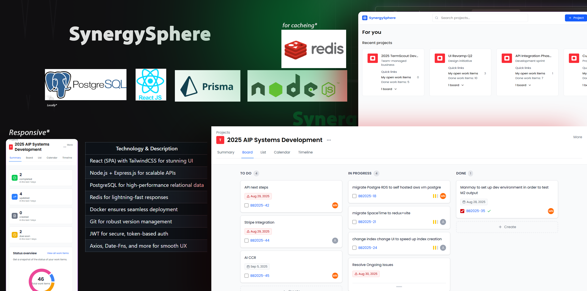

# 🌐 SynergySphere – Advanced Team Collaboration Platform

---

## 🚀 Table of Contents

* [Project Overview](#project-overview)
* [Problem Statement](#problem-statement)
* [Proposed Solution](#proposed-solution)
* [Technical Stack](#technical-stack)
* [Key Features](#key-features)
* [Architecture](#architecture)
* [Screenshots & GIFs](#screenshots--gifs)
* [Setup Instructions](#setup-instructions)
* [Contribution Guidelines](#contribution-guidelines)
* [License](#license)

---

## 🌟 Project Overview

**SynergySphere** is built on a simple idea: **teams do their best work when their tools truly support how they think, communicate, and move forward together.**

It’s a **desktop and mobile-ready collaboration platform** designed to be the intelligent backbone for teams, helping them stay organized, communicate better, manage resources efficiently, and make informed decisions—proactively, not reactively.

**Goals:**

* Enable seamless **project and task management**.
* Provide **real-time team communication** and collaboration.
* Act as a **command center** for tracking progress and resources.
* Deliver a **smooth, intuitive, and responsive experience** for both mobile and desktop users.

---

## 🛑 Problem Statement

Teams across all domains face the same persistent headaches:

* **Scattered Information:** Files, chats, and decisions are spread across multiple platforms.
* **Unclear Progress:** Task and project visibility is limited.
* **Resource Overload or Confusion:** Team members are often overworked or unsure of priorities.
* **Deadline Surprises:** Issues are discovered too late.
* **Communication Gaps:** Messages get lost in emails or scattered chats.

**SynergySphere** addresses these pain points by orchestrating collaboration **intelligently and proactively**, ensuring teams work smarter and stay aligned.

---

## 💡 Proposed Solution

SynergySphere transforms team collaboration by combining **task management**, **team communication**, and **proactive insights** in one platform.

**Highlights:**

* **Dynamic Task Management:** Create, assign, and track tasks with statuses like To-Do, In Progress, and Done.
* **Project-Specific Communication:** Threaded discussions keep conversations organized.
* **User & Resource Management:** Add members, assign responsibilities, and balance workloads.
* **Real-Time Updates:** Notifications for tasks, deadlines, and team activities.
* **Mobile & Desktop Ready:** Seamless experience across devices.
* **Data-Efficient Design:** Stable and responsive even with multiple projects and teams.

---

## 🛠 Technical Stack

Prepare to be amazed by the powerhouse technologies behind SynergySphere!

| Layer            | Technology & Description                        | Documentation / Links                                                   |
| ---------------- | ----------------------------------------------- | ----------------------------------------------------------------------- |
| Frontend         | React (SPA) with TailwindCSS for stunning UI    | [React](https://reactjs.org/) / [TailwindCSS](https://tailwindcss.com/) |
| Backend          | Node.js + Express.js for scalable APIs          | [Node.js](https://nodejs.org/) / [Express.js](https://expressjs.com/)   |
| Database         | PostgreSQL for high-performance relational data | [PostgreSQL](https://www.postgresql.org/)                               |
| Caching          | Redis for lightning-fast responses              | [Redis](https://redis.io/)                                              |
| Containerization | Docker ensures seamless deployment              | [Docker](https://www.docker.com/)                                       |
| Version Control  | Git for robust version management               | [Git](https://git-scm.com/)                                             |
| Authentication   | JWT for secure, token-based auth                | [JWT](https://jwt.io/)                                                  |
| Utilities        | Axios, Date-Fns, and more for smooth UX         | [Axios](https://axios-http.com/) / [Date-Fns](https://date-fns.org/)    |

> Click on the links to explore each technology in detail.

---

## 🔑 Key Features

* **User Authentication:** Secure login and registration.
* **Project Dashboard:** List, create, and manage projects effortlessly.
* **Task Management:** Assign tasks with due dates, status tracking, and priority indicators.
* **Team Collaboration:** Threaded discussions for each project.
* **Progress Visualization:** Intuitive task boards and status charts.
* **Notifications:** Alerts for important updates and deadlines.
* **Responsive UI:** Optimized for mobile and desktop interfaces.

---

## 🏗 Architecture

**SynergySphere follows a modular, scalable architecture:**

* **Frontend (React SPA):** Handles responsive UI and interactions.
* **Backend (Node.js + Express):** Manages business logic and database communication.
* **Database (PostgreSQL):** Optimized for relational data efficiency.
* **Docker:** Ensures consistent deployment across platforms.

---

## 📸 Screenshots & GIFs

**Mobile Dashboard:**

**Project Detail View:**

**Task Board View:**

**Notifications & Communication:**

---

## ⚙️ Setup Instructions

### Prerequisites

* Node.js >= 18.x
* PostgreSQL >= 14.x
* Docker >= 24.x

---

## 🤝 Contribution Guidelines

* Follow **feature branching** and **frequent commits**.
* Maintain **clean, modular, and well-documented code**.
* Collaborate on **testing, bug fixes, and UI improvements**.
* Share ownership and foster **team synergy**!

---

---

> SynergySphere brings **intelligent collaboration, intuitive task management, and seamless communication** together in a single platform—designed to let teams operate at their absolute best.
